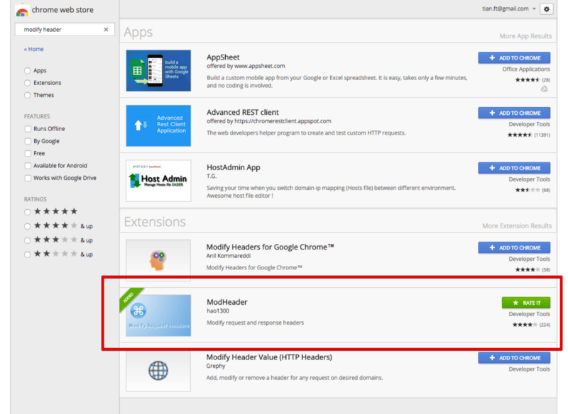
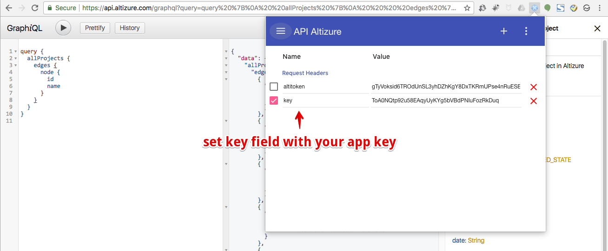
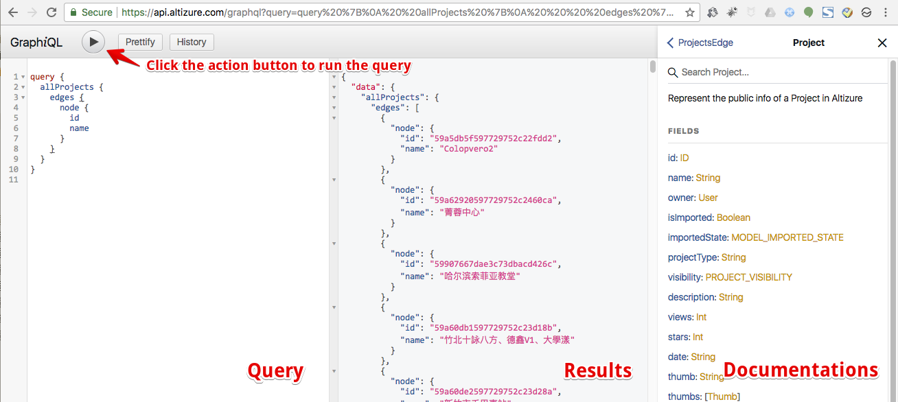

# Altizure Graphql API

Altizure GraphQL API is a set of API in the syntax of [GraphQL](http://graphql.org/learn/). The API allows developers to fetch and modify the data on Altizure.

## 1. Prerequisite

* Altizure developer account
* App key
* User token (optional)

## 2. API Endpoint and Documentations

API endpoints and documentations： [api.altizure.com/graphql](https://api.altizure.com/graphql) 。

## 3. Try out API in your browser

It is very convenience to test the API in browsers, because it provides instant feedback on the query results and detailed inline documentations. After the testing, you can easily copy and paste the query string to your code and trigger the API call.

We take Google Chrome as an example. Other browsers supporting extensions, e.g. Firefox, should work too.

##### Install extension

First, please install an extension that can modify the http request header. Here ModHelper is used. Please search and install `ModHelper` in the extension store of Google Chrome.



##### Modify http header

Please use ModHelper to add `key` field in request header with app key as the value.



Visit [api.altizure.com/graphql](https://api.altizure.com/graphql) after setting the key. You can find three sections: "query section", "result section", and "documentation", on the page.

Now please fill the following query string to the query section to get the ID and name of public projects.

```
query {
  allProjects {
    edges {
      node {
        id
        name
      }
    }
  }
}
```

Please click the action button to get the query results.



##### Get user authentication

To acccess and modify user related information, app should get users' authentication by getting the user token. Then put the user token into the `altitoken` field in http request header.

Please use the following mutation to get user token:

```
mutation {
  getUserToken(email: "user email", password: "user password")
}
```

## 4. Integrate the API in your code

The API can be called by any libs and programming languages that can issue a http post request.

For example:

*JQurey in Javascript*

```
$.ajax({
    type: 'POST',
    url: 'https://api.altizure.com/graphql',
    headers: {
      altitoken: 'user token',
      key: 'app key'
    },
    data: 'query=' + 'GraphGL query string'
  })
```

## 5. Learn more

* Learn more about [GraphQL](http://graphql.org/learn/)
* Use [Altizure Javascript SDK](jssdk.md) to developer rich 3D application
* More tools on GraphQL: [Awesome GraphGL](https://github.com/chentsulin/awesome-graphql)
