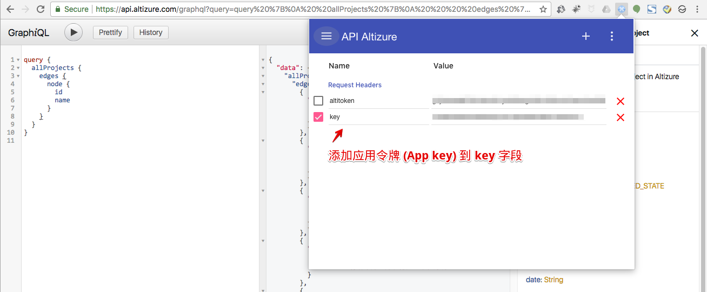
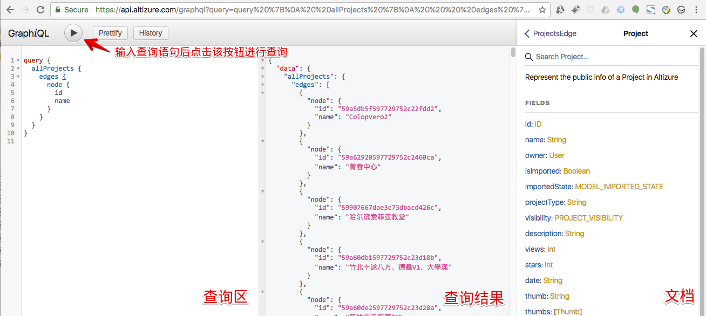

# Altizure Graphql API

GraphQL API 是一组以 [GraphQL](http://graphql.org/learn/) 为协议提供的在线 API。这套 API 提供了获取和修改 Altizure 上基础数据的能力。

## 1. 使用前准备

* Altizure 开发者账号 (必须)
* 应用令牌 (App key) (必须)
* 用户令牌 (User token) (部分调用需要)

## 2. API 网址和文档

API 调用和文档的入口： [api.altizure.com/graphql](https://api.altizure.com/graphql) 。

## 3. 在浏览器中测试 API

在浏览器中测试 API，可以在浏览文档的同时测试，提高开发效率。确定数据正确后，才把相关的调用复制到代码中集成，过程轻松简单。

这里的教程以谷歌 Chrome 浏览器为例子，其他支持插件的浏览器也可以用类似的方法做测试。

##### 安装插件

安装一个可以修改 http 访问请求 header 的插件。这里我们以 ModHelper 为例。在谷歌 Chrome 扩展商店里面搜索 `ModHelper`，并点击安装即可。


##### 设置插件修改 http header

在 request header，添加`key`字段，填入应用令牌 (App key)。



设置完成后访问 [api.altizure.com/graphql](https://api.altizure.com/graphql)，可以看到一下界面，集成了“查询区”，“查询结果”和“文档”三个模块。

试着在查询区输入一下字段查询现在公开的项目的 ID 和名字。

```
query {
  allProjects {
    edges {
      node {
        id
        name
      }
    }
  }
}
```

并按查询按钮，便可获得查询结果。



##### 用户相关信息

如需访问用户相关信息，需要在 request header 添加 `altitoken`字段，输入用户令牌 (User token)。

可以通过以下 mutation 获取用户令牌：

```
mutation {
  getUserToken(email: "用户邮件", password: "用户密码")
}
```

## 4. 在代码中集成 API 调用

您可以使用任何可以发起 http post request 的程序库来调用 GraphQL API。

例如：

*JQurey in Javascript*

```
$.ajax({
    type: 'POST',
    url: 'https://api.altizure.com/graphql',
    headers: {
      altitoken: '用户令牌',
      key: '应用令牌'
    },
    data: 'query=' + 'GraphGL的查询字符串'
  })
```

## 5. 了解更多

* 深入学习 [GraphQL](http://graphql.org/learn/)
* 通过 [Altizure Javascript SDK](jssdk.md) 实现丰富的三维浏览编辑功能
* 更多 GraphQL 相关工具 [Awesome GraphGL](https://github.com/chentsulin/awesome-graphql)
